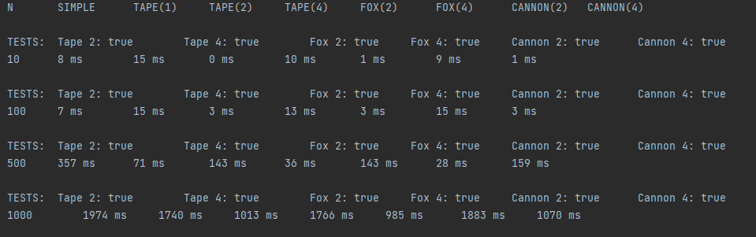

Обчислення з використанням MPI .
Створити додаток в якому обчислюється паралельне множення матриць .
 
Послідовний алгоритм
Алгорітм1 -стрічкова схема
Алгорітм2 -метод Фокса
Алгорітм3 -метод Кеннона
 
Розрахунки по кожному алгоритму з робити у вигляді таблиці послідовний (1 потік), 2 потоку, 4 потоки.

